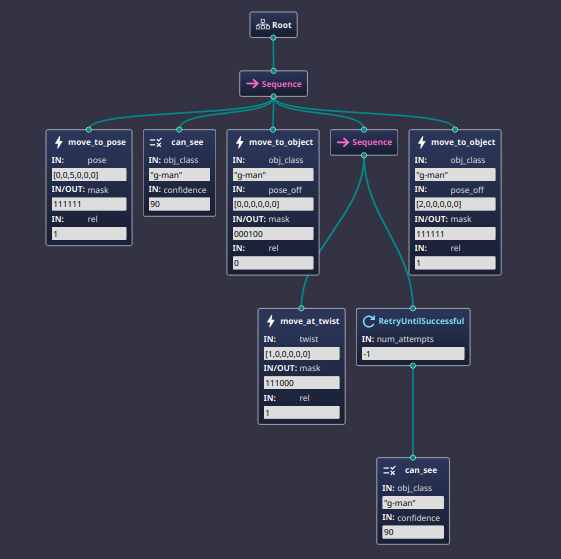

# Overview

Autonomy is a fundamental requirement for any system to understand what to do with it's gathered data. Behavioral trees are a simple and straightforward method in achieving autonomy in robots. For this implementation, the library behaviortree.cpp will be utilized in conjuction with ROS2 Iron to detail what commands are sent in what order. This library was also created with Ubuntu 22.04.4 LTS. More details on the individual components of this system can be found below.

- [BehaviorTree.cpp Documentation](https://www.behaviortree.dev/docs/intro)
- [ROS Iron Documentation](https://docs.ros.org/en/iron/index.html)

A history of the steps and processes taken within it's development will also be outlined. Information on how to implement and create new nodes within this system will also be listed.

---
## Getting Started

Clone this directory at: 

- [This Repository](https://github.com/RoboSubLA/rsla_autonomy/)

This project will include everything that will be needed to run the autonomy system. Some systems that are included are the cmakelist configs needed for linking behaviortree.cpp, the autonomy specific nodes, and a few test trees (provided through groot).

From then on, separately download, build, and install ROS2 Iron 

- [ROS Iron Installation Guide](https://docs.ros.org/en/iron/Installation.html)

---
## Step 1: Build the file with colcon build

Building the file will compile it and also link together the independent files.

## Step 2: Source the overlay and underlay

Two layers are needed in order to make sure that the program doesn't source where it was built or vice versa. Otherwise 'complex issues' can arise.

From Home:
> source /opt/ros/iron/setup.bash

From Root of Workspace (where you cloned the repo):
> source install/local_setup.bash

## Step 3: It's Done!

Your program should now be running correctly, and will have publishers and subscribers (from ROS2) doing their respective actions.

---
# Composition of structure in main.cpp

---
# How to make a new Node

If the situation arises that a new node is needed or an existing node needs editing, below is a quick guide on what is needed to ensure a node works.

## Quick Steps on Creating a Node

1. Copy a basic template node
2. Determine what needs to be changed
  - Usually things like data values, variables, etc.
3. Understand what the autonomy node does, and check that it's happy
  - Data values and variables are set from the autonomy node through the callback function
  - Done usually when any subscriber in the autonomy node receives a message
4. (Optional) If it needs one add a subscriber to autonomy_node.hpp for your node
  - To use this, your node must have a pointer to the autonomy node so it can access that subscriber 
5. Add callback to autonomy_node.hpp
6. Add the node to nodes.h header file
7. Register the node to main.cpp 
8. Give the node a pointer to the autonomy_node.hpp

